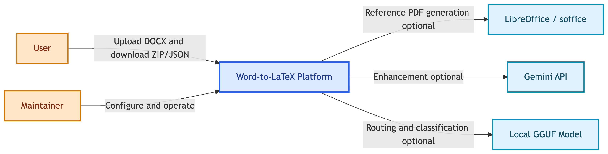
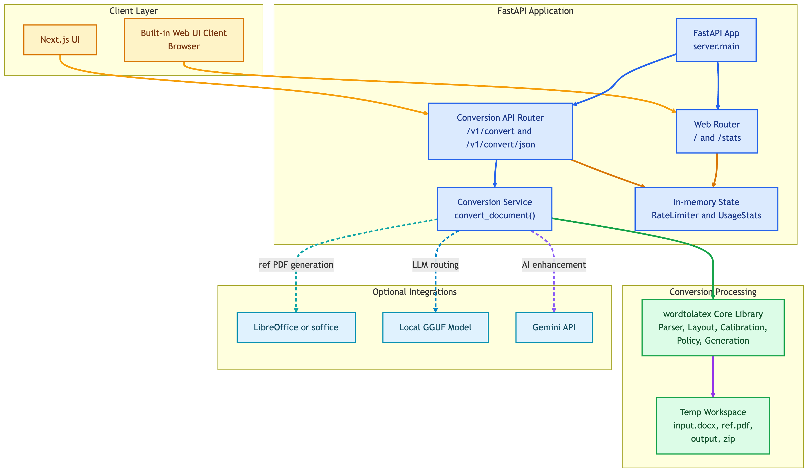
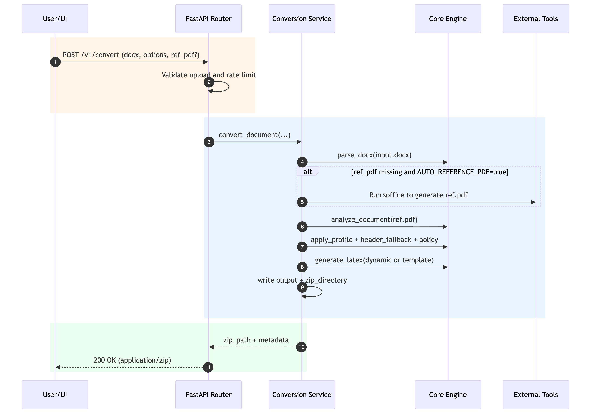

# Word-to-LaTeX Server

A layout-aware DOCX to LaTeX conversion platform with:
- a FastAPI backend (`src/server`)
- a core conversion engine (`src/wordtolatex`)
- a modern Next.js frontend (`frontend/`)

The system is optimized for resumes, reports, and academic-style documents where preserving structure and visual intent matters.

## Highlights

- DOCX -> LaTeX conversion with ZIP packaging (`.tex` + extracted media).
- Dynamic, template-free generation mode (`dynamic=true`) for layout-sensitive output.
- Optional reference-PDF analysis (font, spacing, margins, visual regions).
- Optional calibration profiles (`auto`, `resume`, `academic_*`, `default`).
- Optional local LLM routing (GGUF model) and optional Gemini enhancement.
- Built-in web UI + API + CLI.
- In-memory rate limiting and lightweight usage stats.

## Architecture

Detailed C4-style architecture and system design diagrams are in:

- [docs/ARCHITECTURE.md](docs/ARCHITECTURE.md)

This includes:
- C4 Level 1: System Context
- C4 Level 2: Container Diagram
- C4 Level 3: Conversion Component Diagram
- Runtime request lifecycle diagram

### C4 Level 1 - System Context



### C4 Level 2 - Container Diagram



### C4 Level 3 - Component Diagram


### Runtime Request Lifecycle



## Repository Layout

```text
wordtolatex-server/
├── src/
│   ├── server/                  # FastAPI app (web + API)
│   └── wordtolatex/             # Core DOCX -> LaTeX pipeline
├── frontend/                    # Next.js UI
├── tests/                       # Unit/integration/corpus tests
├── scripts/                     # Evaluation + tooling scripts
├── tools/                       # Diagnostics + training helpers
├── docs/                        # Notes + architecture docs
└── pyproject.toml
```

## Conversion Pipeline (High Level)

1. Parse DOCX into intermediate representation (`docx_parser`).
2. Optionally classify document type/layout with local LLM router.
3. Resolve/generate reference PDF (optional but enabled by default).
4. Analyze reference layout (`layout_ml`) and inject layout hints.
5. Select/apply calibration profile (`calibration`).
6. Apply header image fallback when enabled.
7. Assign policy per block (`policy`).
8. Generate LaTeX (`dynamic_generator` or `generator`).
9. Write output + package ZIP for download.

## Prerequisites

- Python `>=3.10`
- [uv](https://docs.astral.sh/uv/) (recommended)
- LibreOffice/`soffice` (optional, needed for auto reference-PDF generation)
- Node.js `>=18` (only for Next.js frontend development)

## Quickstart (Backend API)

```bash
# 1) Create and activate virtual env
uv venv
source .venv/bin/activate

# 2) Install package (with dev extras)
uv pip install -e ".[dev]"

# 3) Run API server
uv run uvicorn server.main:app --reload --host 0.0.0.0 --port 8000
```

Open:
- API/Web root: `http://localhost:8000/`
- Health: `http://localhost:8000/health`

## Quickstart (Next.js Frontend)

```bash
cd frontend
npm install
WORDTOLATEX_API_BASE_URL=http://localhost:8000 npm run dev
```

Open `http://localhost:3000`.

## API Reference

### `GET /health`

Returns service status.

```bash
curl http://localhost:8000/health
```

### `GET /stats`

Returns in-memory counters:
- `visitor_count`
- `conversion_count`

### `POST /v1/convert`

Converts DOCX and returns a ZIP file.

Multipart form fields:
- `docx` (required)
- `ref_pdf` (optional)
- `options_json` (optional JSON string; only honored if `ALLOW_USER_OPTIONS=true`)

```bash
curl -X POST "http://localhost:8000/v1/convert" \
  -F "docx=@tests/corpus/Resume_1/src.docx" \
  -F "ref_pdf=@tests/corpus/Resume_1/ref.pdf" \
  -F 'options_json={"profile":"auto","dynamic":true,"header_fallback":true}' \
  -o wordtolatex_output.zip
```

### `POST /v1/convert/json`

Returns conversion response as JSON (no ZIP/media payload):

- `latex`
- `doc_type`
- `layout_style`
- `metadata` (empty unless `EXPOSE_METADATA=true`)

```bash
curl -X POST "http://localhost:8000/v1/convert/json" \
  -F "docx=@tests/corpus/Resume_1/src.docx" \
  -F 'options_json={"profile":"auto"}'
```

## Conversion Options (`options_json`)

Note: by default these are ignored (`ALLOW_USER_OPTIONS=false`).

- `profile`: `auto | academic_twocol | academic_singlecol | resume | default`
- `dynamic`: `true | false` (default `true`)
- `header_fallback`: `true | false` (default `true`)
- `local_llm`: `true | false | null` (null uses server default)
- `llm_model`: path to local GGUF model
- `use_gemini`: `true | false | null` (null uses server default)
- `calibrate`: `true | false`

## Configuration (Environment Variables)

`pydantic-settings` maps environment variables from `Settings` in `src/server/config.py`.
Use uppercase snake_case names.

Core:
- `APP_NAME` (default: `wordtolatex-server`)
- `API_PREFIX` (default: `/v1`)
- `ENVIRONMENT` (default: `local`)
- `LOG_LEVEL` (default: `INFO`)
- `TEMP_DIR_PREFIX` (default: `wordtolatex-`)

Rate limiting:
- `RATE_LIMIT_ENABLED` (default: `true`)
- `RATE_LIMIT_COOLDOWN_SECONDS` (default: `1800`)
- `RATE_LIMIT_TRUST_FORWARDED` (default: `true`)

Request behavior:
- `ALLOW_USER_OPTIONS` (default: `false`)
- `EXPOSE_METADATA` (default: `false`)

Reference PDF generation:
- `AUTO_REFERENCE_PDF` (default: `true`)
- `REFERENCE_PDF_COMMAND` (default: `soffice`)
- `REFERENCE_PDF_ARGS` (default: `--headless --convert-to pdf --outdir {outdir} {input}`)
- `REFERENCE_PDF_TIMEOUT_SECONDS` (default: `120`)

LLM defaults:
- `DEFAULT_USE_LOCAL_LLM` (default: `true`)
- `DEFAULT_USE_GEMINI` (default: `false`)
- `DEFAULT_LLM_MODEL` (default: unset)

## CLI Usage

Install package first, then run:

```bash
wordtolatex input.docx output.tex --profile auto --dynamic
```

Useful options:
- `--ref-pdf path/to/ref.pdf`
- `--calibrate`
- `--header-fallback/--no-header-fallback`
- `--local-llm/--no-local-llm`
- `--llm-model path/to/model.gguf`
- `--report report.json`

## Development & Testing

Install dev dependencies:

```bash
uv pip install -e ".[dev]"
```

Run tests:

```bash
uv run pytest
```

Run a focused test file:

```bash
uv run pytest tests/test_integration.py -q
```

## Troubleshooting

- `Reference PDF generation failed (command not found)`
  - Install LibreOffice or set `REFERENCE_PDF_COMMAND` + `REFERENCE_PDF_ARGS`.
- `429 Rate limit exceeded`
  - Wait for cooldown or reduce `RATE_LIMIT_COOLDOWN_SECONDS` in local dev.
- `options_json` appears ignored
  - Set `ALLOW_USER_OPTIONS=true`.
- Local LLM routing not applied
  - Install llm extras (`uv pip install -e ".[llm]"`) and set `DEFAULT_LLM_MODEL` or pass `llm_model`.

## Notes

- Runtime counters and rate-limit state are in-memory (single-process scope).
- Large model weights/datasets are intentionally not part of the core source layout.
