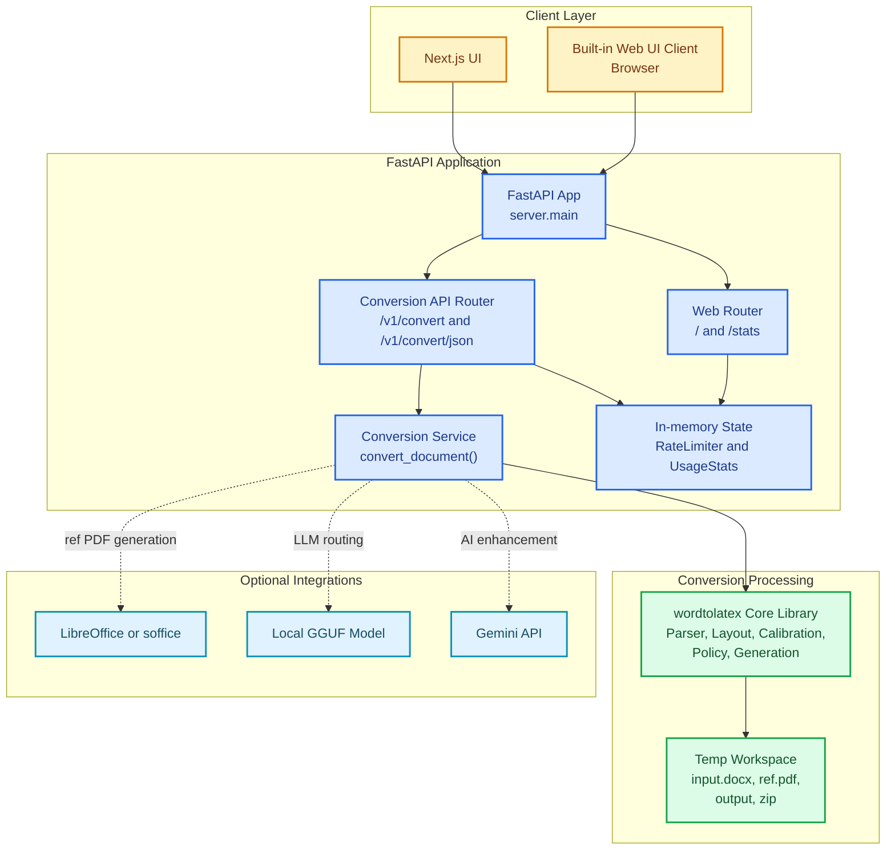
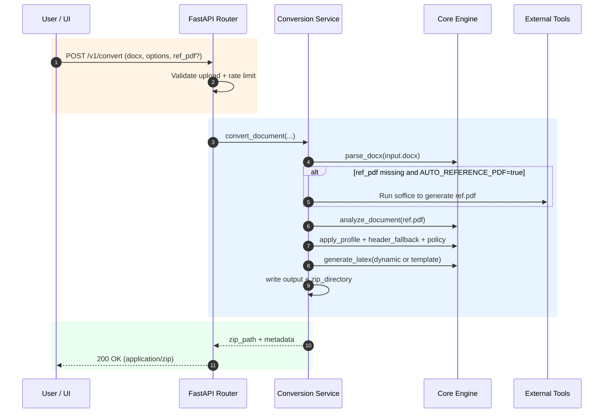

# Architecture and System Design (C4 Style)

This document describes the system using C4-inspired views and a runtime flow diagram.
All diagrams use color/styling so responsibilities and trust boundaries are easy to scan.

## C4 Level 1 - System Context

```mermaid
flowchart LR
    user["User<br/>(Uploads DOCX, downloads ZIP)"]
    maintainer["Maintainer / Developer<br/>(Operates services)"]

    system["Word-to-LaTeX Platform<br/>DOCX -> LaTeX conversion service"]

    office["LibreOffice / soffice<br/>(Reference PDF generation)"]
    gemini["Gemini API<br/>(Optional enhancement)"]
    localLlm["Local GGUF Model<br/>(Optional routing/classification)"]

    user -->|Upload DOCX, get ZIP/JSON| system
    maintainer -->|Configure + deploy| system

    system -->|Convert DOCX to PDF (optional)| office
    system -->|LLM prompt/response (optional)| gemini
    system -->|Inference (optional)| localLlm

    classDef actor fill:#FFE6C9,stroke:#D97706,color:#7C2D12,stroke-width:2px;
    classDef system fill:#DBEAFE,stroke:#2563EB,color:#1E3A8A,stroke-width:2.5px;
    classDef external fill:#E0F2FE,stroke:#0891B2,color:#164E63,stroke-width:2px;

    class user,maintainer actor;
    class system system;
    class office,gemini,localLlm external;
```

## C4 Level 2 - Container Diagram



## C4 Level 3 - Component Diagram (Conversion Path)


## Runtime Request Lifecycle (System Design View)



## Notes

- The current implementation keeps rate limiting and stats in process memory.
- `options_json` is intentionally ignored unless `ALLOW_USER_OPTIONS=true`.
- External integrations are optional and controlled by settings.
