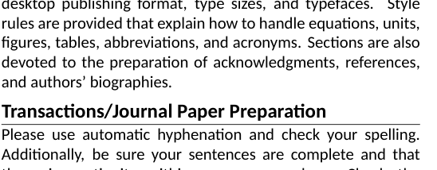
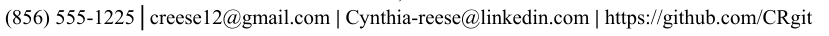
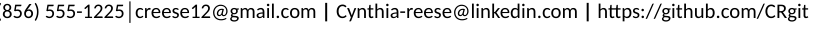
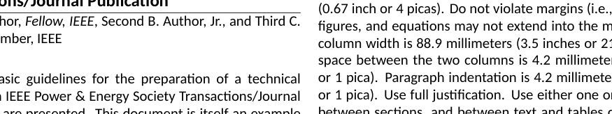

# Top Offenders Report

Worst-performing regions by strict SSIM score.

| # | Document | Page | Label | Strict SSIM | Aligned SSIM | Drift (dx, dy) |
|---|----------|------|-------|-------------|--------------|----------------|
| 1 | Resume_1 | 0 | title | 0.002 | 0.014 | (-15, -16) |
| 2 | Resume_1 | 0 | title | 0.009 | 0.179 | (55, -42) |
| 3 | Resume_1 | 0 | figure | 0.017 | 0.024 | (-16, -59) |
| 4 | Resume_1 | 0 | title | 0.032 | 0.221 | (-15, 4) |
| 5 | Resume_2 | 0 | title | 0.041 | 0.382 | (56, -11) |
| 6 | IEEE_TEMPLATE | 0 | list | 0.057 | 0.301 | (55, -64) |
| 7 | Resume_2 | 0 | title | 0.089 | 0.371 | (-48, 40) |
| 8 | Resume_2 | 0 | title | 0.090 | 0.370 | (-7, -56) |
| 9 | IEEE_TEMPLATE | 0 | title | 0.113 | 0.370 | (-64, -64) |
| 10 | IEEE_TEMPLATE | 0 | title | 0.141 | 0.295 | (-63, -32) |
| 11 | Microsoft_Resume_2 | 0 | title | 0.154 | 0.270 | (-64, -64) |
| 12 | Resume_1 | 0 | figure | 0.160 | 0.209 | (-64, -64) |
| 13 | Resume_2 | 0 | list | 0.161 | 0.639 | (-62, -56) |
| 14 | Microsoft_Resume_2 | 0 | title | 0.166 | 0.312 | (-64, -48) |
| 15 | Custom_Resume | 0 | title | 0.237 | 0.520 | (-62, 51) |
| 16 | Custom_Resume | 0 | title | 0.239 | 0.582 | (-12, -64) |
| 17 | Resume_1 | 0 | title | 0.248 | 0.546 | (-41, -25) |
| 18 | Resume_1 | 0 | figure | 0.259 | 0.311 | (-40, -56) |
| 19 | Microsoft_Resume1 | 0 | figure | 0.309 | 0.515 | (64, -64) |
| 20 | Microsoft_Resume1 | 0 | figure | 0.432 | 0.581 | (-40, 48) |

## Image Previews

### 1. Resume_1 p0 title

| Reference | Generated | Diff |
|-----------|-----------|------|
|  |  |  |

### 2. Resume_1 p0 title

| Reference | Generated | Diff |
|-----------|-----------|------|
|  |  |  |

### 3. Resume_1 p0 figure

| Reference | Generated | Diff |
|-----------|-----------|------|
|  |  |  |

### 4. Resume_1 p0 title

| Reference | Generated | Diff |
|-----------|-----------|------|
|  |  |  |

### 5. Resume_2 p0 title

| Reference | Generated | Diff |
|-----------|-----------|------|
|  |  |  |

### 6. IEEE_TEMPLATE p0 list

| Reference | Generated | Diff |
|-----------|-----------|------|
|  |  |  |

### 7. Resume_2 p0 title

| Reference | Generated | Diff |
|-----------|-----------|------|
|  |  |  |

### 8. Resume_2 p0 title

| Reference | Generated | Diff |
|-----------|-----------|------|
|  |  |  |

### 9. IEEE_TEMPLATE p0 title

| Reference | Generated | Diff |
|-----------|-----------|------|
|  |  |  |

### 10. IEEE_TEMPLATE p0 title

| Reference | Generated | Diff |
|-----------|-----------|------|
|  |  |  |
